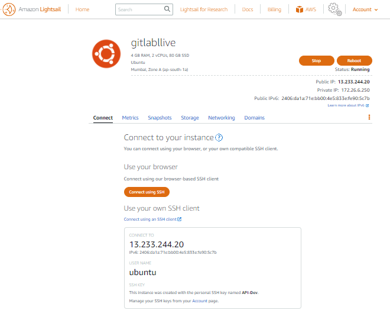
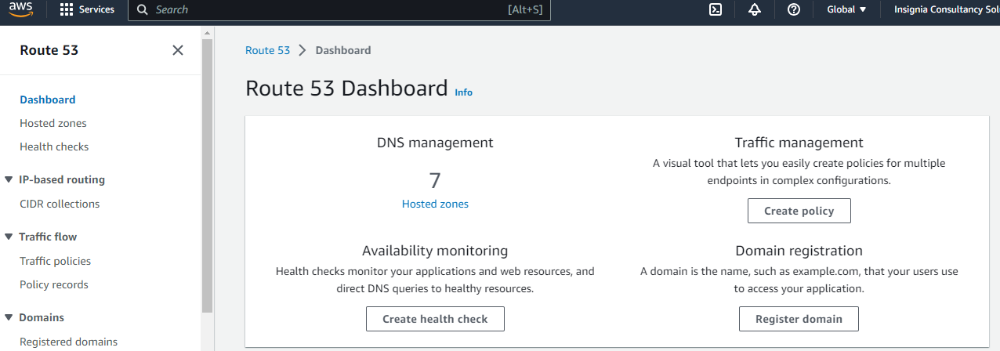

### Setting up the GITLABLIVE SERVER IN AWS LIGHTSAIL
----------------------------------------------------------

* First nagivate to the Lightsail in AWS console. I have already created two instances.
* Select the create instance their you need to be select below configuration.
   
  

* So here we need to select the region, linux, ubuntu. here you need to select the OS in that you can choose which OS. 
  
  

* In the optional section we need to select the key pair for the instace. After that we need to select the plan for the instance. 
 
  

* Here we can give the tag if you any  specific condition or something. Now create the instance by click on create.
* After creating the instance you can able see your instance just click on that and it show the details about your instance. 

  
  

* Now  here if you can we have option CONNECT TO SSH by clicking on that we can directly redirect to the machine.
  

* As you see we have created  a instance successfully. Now we need to install the GITLAB-CE SERVER  which is Community Enterprise and set is up for backup and restore the data from S3.
* For this we need download the backup data to local and from their by sftp method we need to upload the files into server. Take the latest backup to restore in new server.
  
  

* After download try do the below following process to upload the local to server. You check the file size and premission.
  
  
  
  

### INSTALLATION GITLAB-CE IN INSTACE
------------------------------------------------

* We have documention for the installation and setup the gitlab server we can follow that step by step.
* So we need to take the backup for aws s3 bucket manually and put in the server with the maual process.
* This is the best document for installation of GITLAB-CE 
  
  ![REFER]https://computingforgeeks.com/how-to-install-gitlab-ce-on-ubuntu-linux/

  ![refer]https://chat.openai.com/share/e8781988-44ae-4859-99b1-f23625d9efc6

* After the file uploaded into the server we need to put the file into a safe path.
  

* Now we can restore the data with that file by running this command.
   


  ### Step 1: Update System & Install Dependencies
  -------------------------------------------------

* Kickoff the installation by ensuring your system is updated.
  
  ```
  sudo apt update
  sudo apt upgrade -y
  ```
  

  ### Step 2: Configure Postfix Send-Only SMTP 

* Install the required dependencies such as Postfix (for sending emails), curl, and other necessary packages.
* During the Postfix installation, you might be prompted to select an email configuration. Choose 'Internet Site' and then enter the fully qualified domain name for your server.
  
  ```
  sudo apt install -y ca-certificates curl openssh-server tzdata
  sudo apt install curl openssh-server ca-certificates postfix
  ```
   

  ### Step 3: Add the GitLab CE Repository

* Install dependency packages required,
* Run the script below to configure GitLab repository for Debian based systems.
* Now, you can install GitLab using the official GitLab package repository. Run the following commands.
  ```
  sudo apt update
  sudo apt install curl debian-archive-keyring lsb-release ca-certificates apt-transport-https software-properties-common -y
  curl -sS https://packages.gitlab.com/install/repositories/gitlab/gitlab-ce/script.deb.sh | sudo bash
  ```
  

* The repository contents are added to the path below.
  ```
  sudo cat /etc/apt/sources.list.d/gitlab_gitlab-ce.list
  ```

  ### Step 4: Install GitLab CE from repo

* Once the repository has been added, install GitLab CE on Ubuntu 22.04|20.04|18.04 using the apt package manager command. 
  ```
  sudo apt update
  sudo apt install gitlab-ce
  ```
  

* Edit the GitLab configuration file to set hostname and other parameters. Edit that nano file with you host name adding. Replace gitlab.example.com with valid domain for GitLab server.

  ```
  sudo vim /etc/gitlab/gitlab.rb
  external_url 'http://gitlab.example.com'

  ```
  


* After configuring GitLab, reconfigure it and start the services. When done, start your GitLab instance by running the following command.
* All GitLab services should be started after configuration. Now you see all service all running.
  
  ```
  sudo gitlab-ctl reconfigure
  sudo gitlab-ctl restart
  sudo gitlab-ctl status
  ```
  

* Here we can also check version and some important information about server following command.
  
  
  
  ### Step 5: Access GitLab CE Web Interface

* Once the installation of GitLab CE on Ubuntu is done, open the URL http://gitlab.example.com on your browser to finish the installation of Gitlab.

* A password for root user is randomly generated and stored for 24 hours in /etc/gitlab/initial_root_password. You can check the password with the commands below.
* Use this password with username root to login.

  ```
  sudo cat /etc/gitlab/initial_root_password 
  ```
  

* So now we are login into the console with user : root password : which auto genrated. for the first time after that we need to chanage the password.
  
  
  
  
  

  ### Route 53 Setup

* Now we need to set up the AWS ROUTE 53 to access the external url 
   

* Select the hosts and click on insignia consultancy because we have extrenal url is running on that, so if you wee have added an id like gitlablive.insigniaconsultancy.com their we give our ip address to identify the server 
   
   

  ### 500 ERROR Resloving 

* Some time If we didn't  configure correctly it will show 500 error at time we need to run these commands
 
  ```
  sudo gitlab-ctl tail
  sudo gitlab rm /var/opt/gitlab/redis/dump.rdb
  ```

