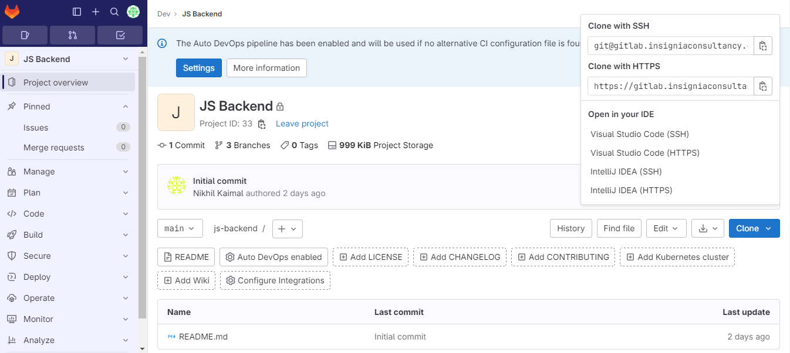
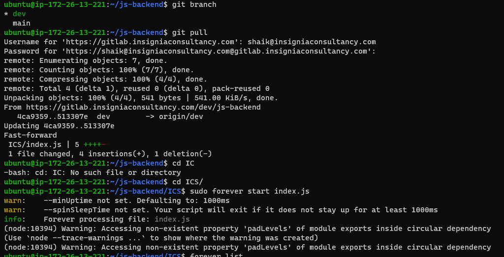
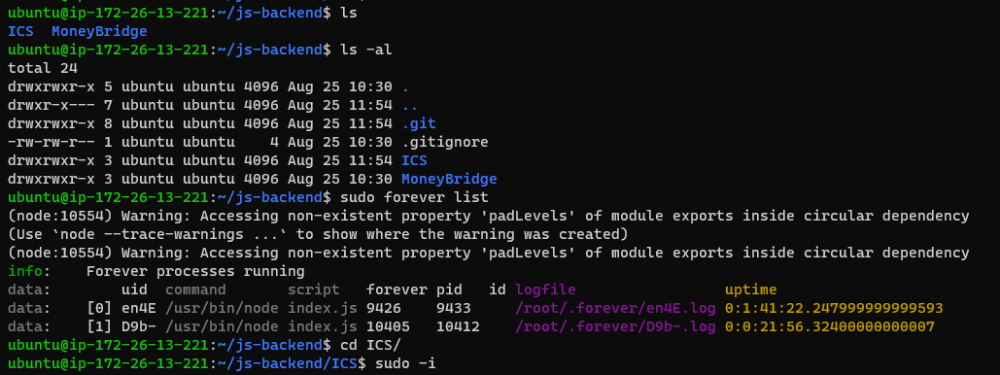
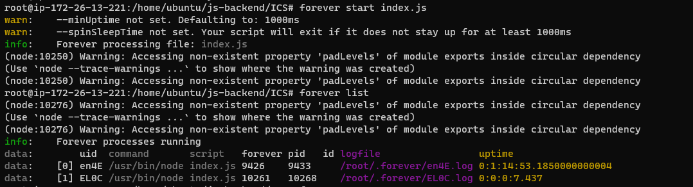
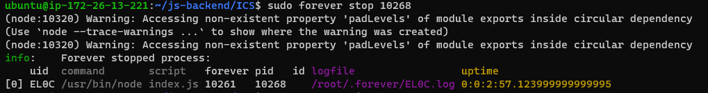
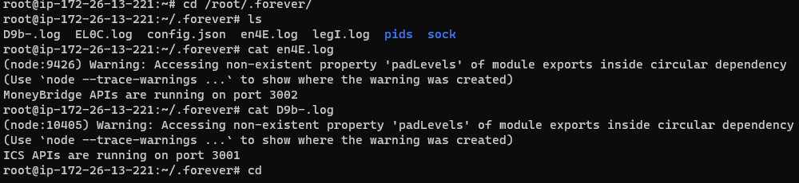
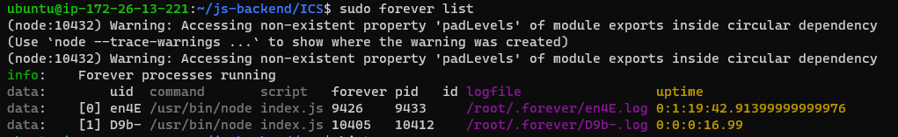
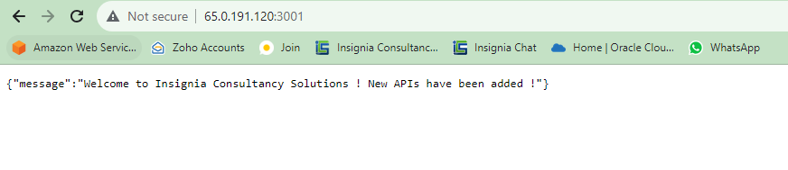
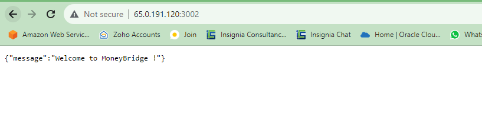

### NODE-JS TEST API-DEV
----------------------------------

* First we need to install some dependices to that server like GitlaB, Node-js, Forever.
* we already know how install a gitlab-ce in the server refer the documentation for process.
  ``` 
  sudo apt install npm
  sudo npm instal forever
  ```
* Now we need to take the code from git lab server for the first time we need to take the gitclone link from gitlab server like below.
  
  

* when we want to just pull the new code changes we can do git pull

  

* After that go the particular path or folder where the code is present. So we have ICS & MoneyBridge, In ICS i have index.js  file so i need to run that file here i should we the forever command.
* We can stop forever stop and pid number from any folder, But we can't start the .js file from any where unless your in particular folder

  
  
  

* Here we can see the forever logs files. For that we have to be a root user in that if do below command.

  ```
  cd /root/.forever/
  ```
   

* so here some forever command we can see the list of background running file through forever.
  
  

  ```
  forever start <filename>
  forever stop <pid no>
  forever list
  forever --help
  ```
* As you can see now we had run the both code of ICS & MoneyBridge parallel in the single server with different ports with forever.
 
  
  