### INSTALLATION OF MYSQL DATABASE ON SERVER
--------------------------------------------------
   NOTE: TO SEE THIS IN PREVIEW MODE PLEASE USE  " SHIFT+CTRL+V "

# Step 1 - Introduction & Installation of MYSQL
------------------------------------------------------
 
 * MYSQL is an open-source database management system, commonly installed as part of the popular LAMP (Linux, Apache, MySQL, PHP/Python/Perl) stack. It implements the relational model and uses Structured Query Language (better known as SQL) to manage its data.
 * To install it, update the package index on your server if you’ve not done so recently.
 * Then install the mysql-server package.
 * Ensure that the server is running using the systemctl start command.

```
sudo apt update
sudo apt install mysql-server
sudo systemctl start mysql.service

```
 * These commands will install and start MySQL, but will not prompt you to set a password or make any other configuration changes. Because this leaves your installation of MySQL insecure, we will address this next.

### Step 2 — Configuring MySQL
-------------------------------
 * For fresh installations of MySQL, you’ll want to run the DBMS’s included security script. This script changes some of the less secure default options for things like remote root logins and sample users.

```
sudo mysql
ALTER USER 'root'@'localhost' IDENTIFIED WITH mysql_native_password BY 'password';
exit
```
 * Following that, you can run the mysql_secure_installation script without issue.
 * Once the security script completes, you can then reopen MySQL and change the root user’s authentication method back to the default, auth_socket. To authenticate as the root MySQL user using a password, run this command.

```
mysql -u root -p
```
 * Then go back to using the default authentication method using this command.
```
ALTER USER 'root'@'localhost' IDENTIFIED WITH auth_socket;
```
 * This will mean that you can once again connect to MySQL as your root user using the sudo mysql command.

```
sudo mysql_secure_installation
```
 * This will take you through a series of prompts where you can make some changes to your MySQL installation’s security options. The first prompt will ask whether you’d like to set up the Validate Password Plugin, which can be used to test the password strength of new MySQL users before deeming them valid.

 * If you elect to set up the Validate Password Plugin, any MySQL user you create that authenticates with a password will be required to have a password that satisfies the policy you select. The strongest policy level — which you can select by entering 2 — will require passwords to be at least eight characters long and include a mix of uppercase, lowercase, numeric, and special characters.
   
   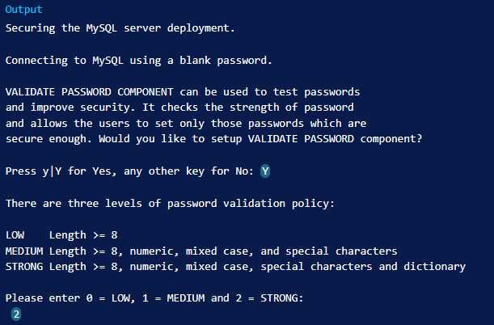

 * Regardless of whether you choose to set up the Validate Password Plugin, the next prompt will be to set a password for the MySQL root user. Enter and then confirm a secure password of your choice.
   
   

 * Note that even though you’ve set a password for the root MySQL user, this user is not currently configured to authenticate with a password when connecting to the MySQL shell.
 * If you used the Validate Password Plugin, you’ll receive feedback on the strength of your new password. Then the script will ask if you want to continue with the password you just entered or if you want to enter a new one. Assuming you’re satisfied with the strength of the password you just entered, enter Y to continue the script.
  
  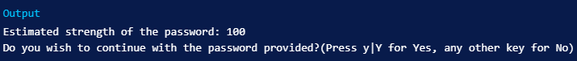

 * From there, you can press Y and then ENTER to accept the defaults for all the subsequent questions. This will remove some anonymous users and the test database, disable remote root logins, and load these new rules so that MySQL immediately respects the changes you have made.

 * Once the script completes, your MySQL installation will be secured. You can now move on to creating a dedicated database user with the MySQL client.
 * Once this process done you can create a Database now in MYSQL Database by using below commands 
  
  ```
  CREATE DATABASE {NAME OF DATABASE}
  ```
  ### Automation Of MySQL Database Backup Into AWS S3 
  -------------------------------------------------------

  * Before you can store any object or data in S3, you need to create a bucket on AWS S3. Follow the below steps to create a bucket on AWS S3.
  * Login to Amazon Management Console, search for S3 and open the S3 service.
   
   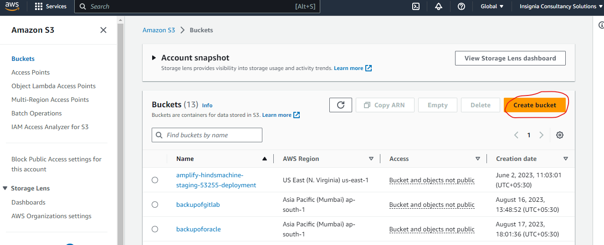
  
  * Click on Create bucket button. You should see the General configuration screen.
  
  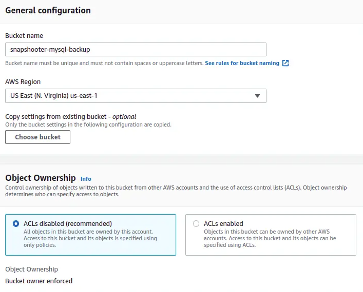
  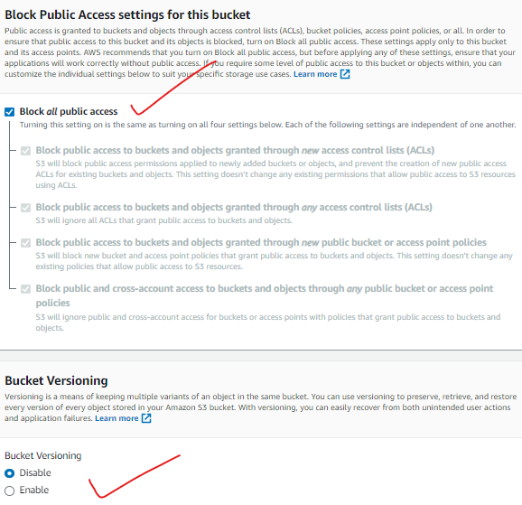
  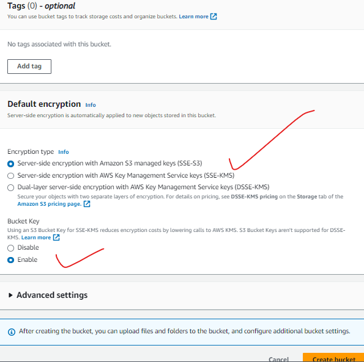

 * Type your bucket name, select your region, Select object ownership, Block all public access, and click on the Create bucket. Once the bucket is created, you will get the following screen.
 
  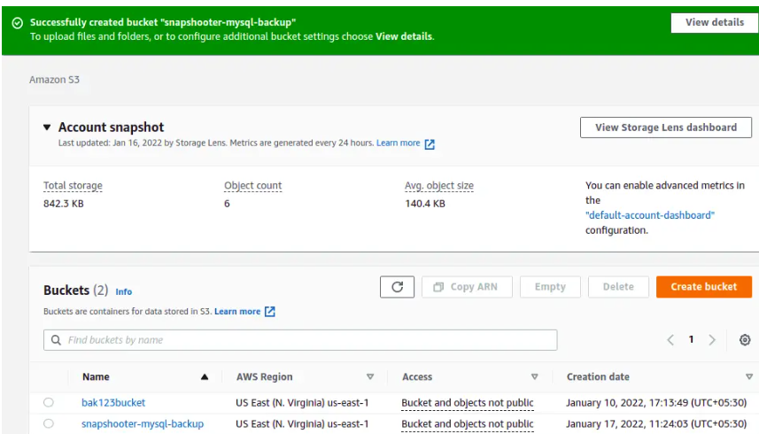

  * So as you can see we have created the S3 bucket successfully. Now we need to create a IAM user in AWS to configuration of aws cloud with local machine.

### Create a New IAM User
----------------------------

* After creating an S3 bucket, you will need to create a new IAM user and assign permission for your S3 bucket. Follow the below steps to create an IAM user.
*  Leave S3, search for IAM from the top services menu, and click on Users on the left sidebar. You should see the IAM user screen.
  
  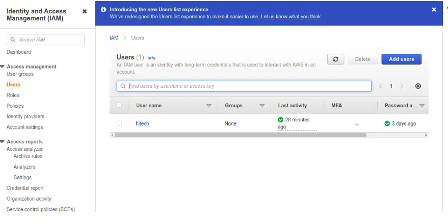

* Click on the Add users button to create a new IAM user. You should see the following screen.
  
  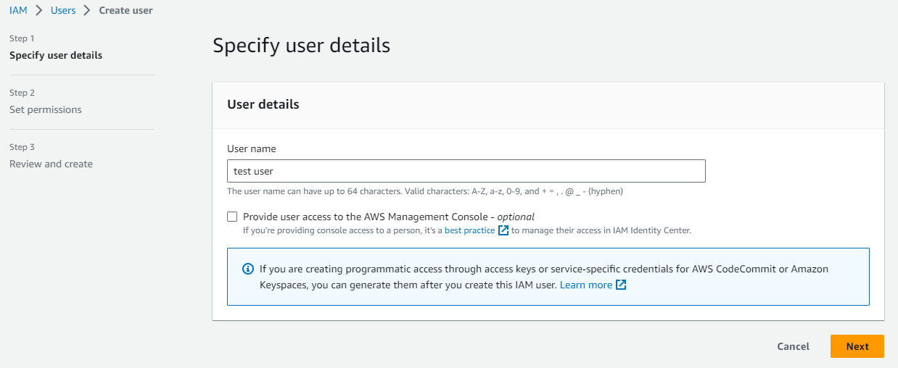

* Give a uniq user name for your user. If you can see their is option to create a user with console access but now we are creating for CLI.("Provide user access to the AWS Management Console - optional")
  
  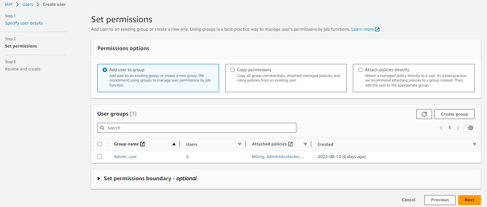
  
* Now if you want to give any premission to this group you need to create a group and add the premission as you can see below.
  
  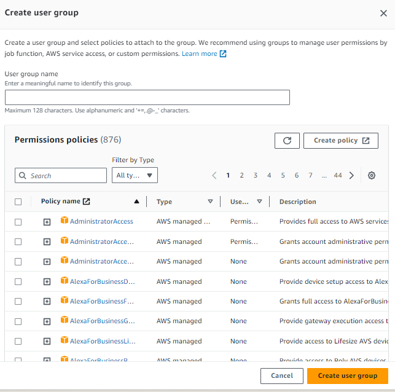

* If you don't need any premission here to this group then you can just skip that part creating group. And just hit on create user.
* After that you need to give specific premission you can also add the by using INLINE POLICY.

  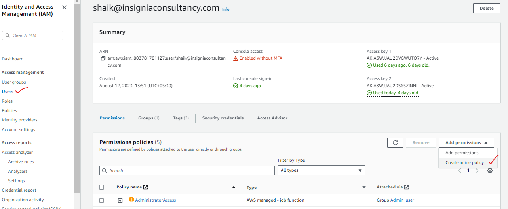

* Here you can select any type of writing the policy i would like to take the JSON format in that in need to select which premission need to add like i select s3.
  
  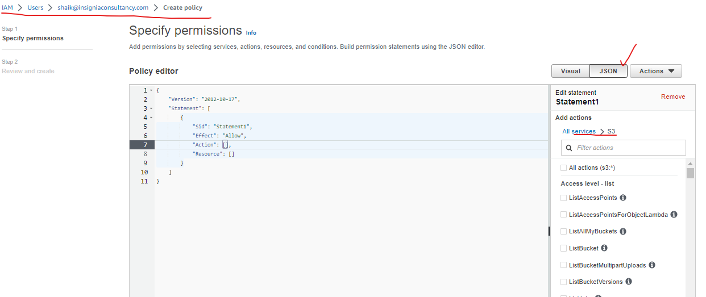
  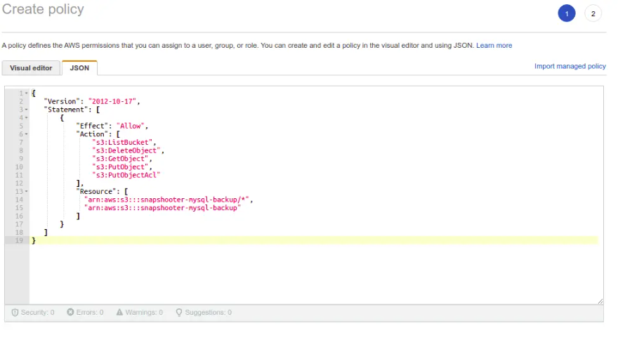

* So going to the next button you can add your premission to the user.
  
  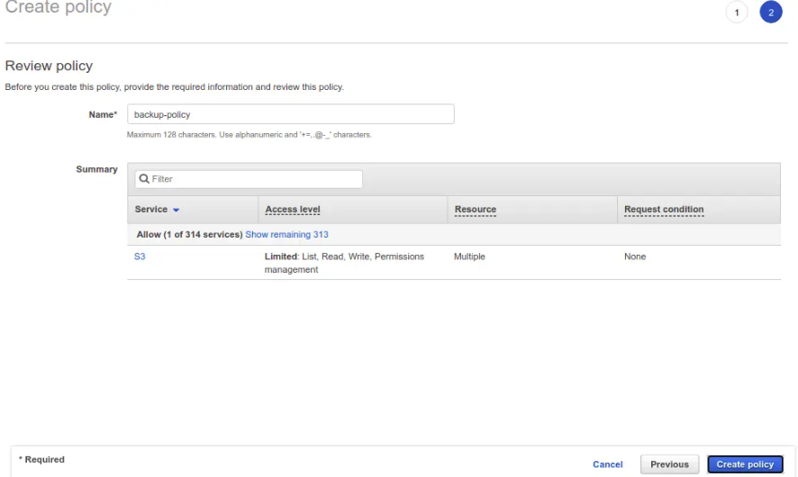

* Provide your policy name and click on the Create policy button to save the policy.
  
### Install AWS CLI Tool
------------------------------

* Before starting, you will need to install the AWS CLI tool on the MySQL server from where you want to backup your databases. The AWS CLI is a command-line tool to manage your AWS services. It helps you to control multiple AWS services from the command line and automate them through scripts.
* First, download the AWS CLI utility using the command given below,unzip the downloaded file and install it using the following command.
  
  ```
  curl "https://awscli.amazonaws.com/awscli-exe-linux-x86_64.zip" -o "awscliv2.zip"
  unzip awscliv2.zip
  sudo ./aws/install
  
  ```
* After installation you need to genrate a Access key and secret key for aws cli login, By using the iam user which you had created before.
  
  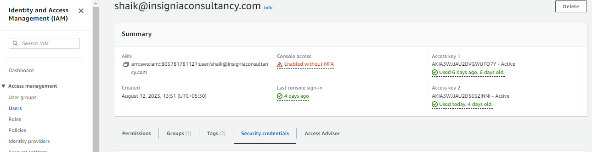
  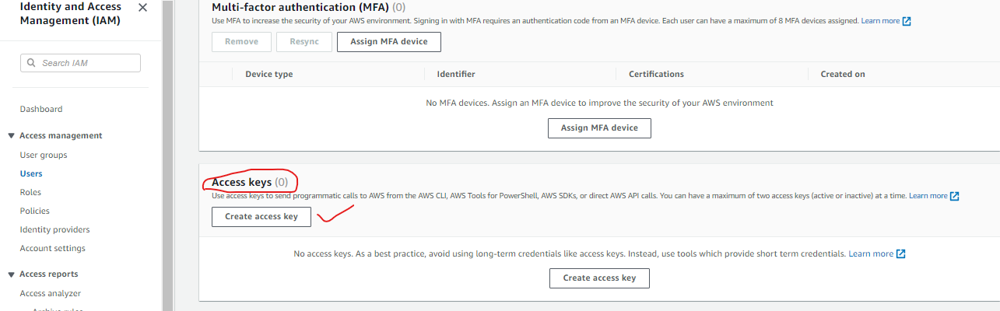
 
  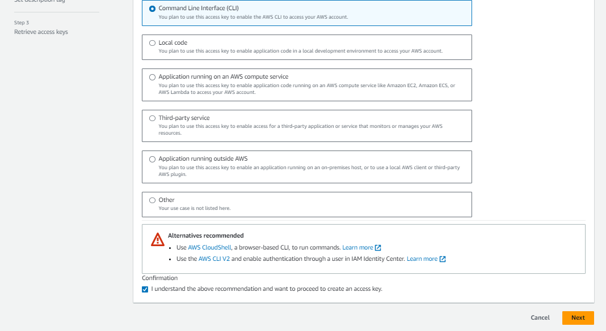
  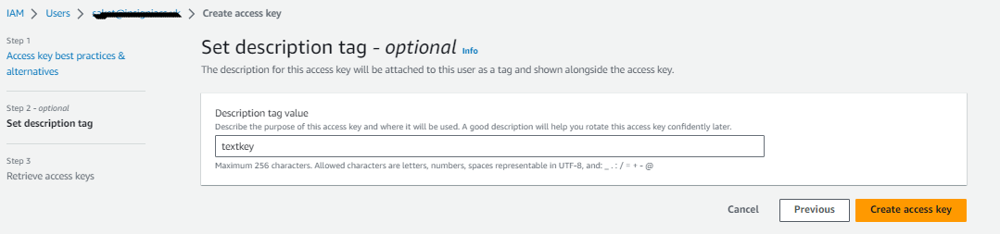
  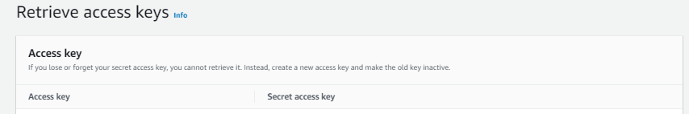
  
* After the installation, you will need to configure AWS CLI with your AWS credentials.
* Provide your AWS access key ID, secret key, and the region as shown below.
  ```
  aws configureAWS 
  Access Key ID [None]: YOUR-AWS-ACCESS-KEY
  AWS Secret Access Key [None]: YOUR-AWS-SECRET-KEY
  Default region name [None]: us-east-1
  Default output format [None]:
  ```
* At this point, the AWS CLI tool is configured on the server to control all AWS services.
  
  ### MANUAL STEPS Of Backup MySQL Database to Amazon S3 
  ------------------------------------------------------------
  * First, log in to the MySQL console with the following command, Once you are log in to MySQL, run the following command to list all databases available on the server.
  
   ```
   mysql -u root -p
   SHOW DATABASES;
   ```
  * It will show the data bases like this output
   ```
   +--------------------+
   | Database           |
   +--------------------+
   | db1                |
   | db2                |
   | information_schema |
   | mysql              |
   | performance_schema |
   | sys                |
   +--------------------+

   exit;
   ```
   * Now, exit from the MySQL console using the following command.
   * Next, use the mysqldump utility to backup your desired MySQL databases from the above list
    ```
    mysqldump -u root -p db1 > db1_backup.sql
    mysqldump -u root -p db2 > db2_backup.sql
    mysqldump -u root -p --all-databases > all_databases.sql
    
    aws s3 cp db1_backup.sql  "s3://snapshooter-mysql-backup"
    aws s3 cp db2_backup.sql  "s3://snapshooter-mysql-backup"
    
   aws s3 cp all_databases.sql  "s3://snapshooter-mysql-backup"
    ```

    * To backup db1_backup.sql and db2_backup.sql database to AWS S3, run the following command
    * Now, use the following syntax to backup your MySQL database to the AWS S3,For example, to back up a MySQL database named all_databases.sql to AWS S3, use the following command.
    *  You will get the following output.
   ```
   upload: ./all_databases.sql to s3://snapshooter-mysql-backup/all_databases.sql
   ```
   * You can now list all databases on the AWS S3 bucket using the following command.
    ```
    2022-01-17 06:50:45    1219017 all_databases.sql
    2022-01-17 06:51:30       1264 db1_backup.sql
    2022-01-17 06:51:51       1264 db2_backup.sql
    ```

    * You can also verify all databases by logging in to the Amazon Web Console, search for S3 and click on your bucket name. You should see the following screen.
   
    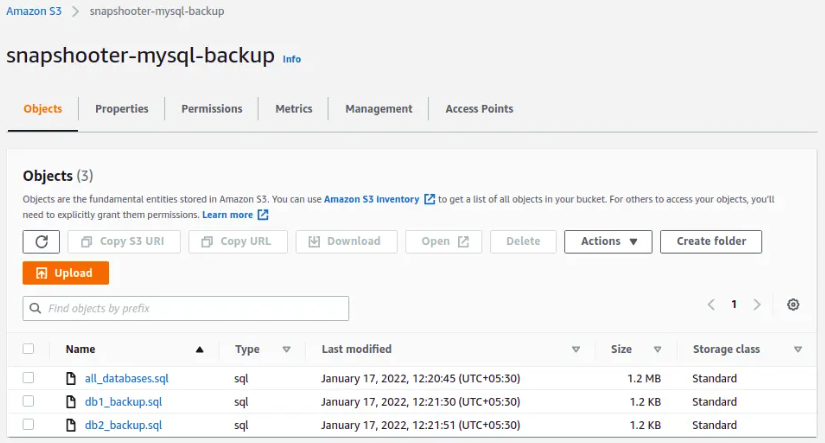

   ### AUTOMATION STEPS Of Backup MySQL Database to Amazon S3
   ---------------------------------------------------------------

   * Before we write the automation script we have do some of same steps like before we done for manual 
      * Creating the S3 bucket 
      * Creation of IAM user
      * Genrating the access key & secret key
      * Install of aws cli
   * Cron is a time-based job scheduler in Unix-like operating systems. It allows users to schedule jobs (commands or scripts) to run periodically at specified times or dates. Cron tab is the configuration file used by the Cron daemon to read the commands and schedule their execution.
   * Here we need to install crontab for automation.
      ```
      sudo apt install crontab
      ```

   * Now we can create a script that will take a backup of our MySQL database and upload it to our S3 bucket. Here’s an example script that you can modify to suit your needs
     ```
     #!/bin/bash

    while :
    do
	    dt=$(date '+%d%m%y')

	    tm=$(date '+%H%M')
	    
        if [ ${tm} -gt 0015 -a ${tm} -le 0115 ]
	    
        then 


            # Backup the MySQL database    
            mysqldump -u 'root' -p'omits#Implants' MoneyBridge > MoneyBridge-backup.sql
		        # Copy MysqlDump to home ubuntu
            scp /home/ubuntu/backup/MoneyBridge-backup.sql .
		        # Upload the backup to S3
            aws s3 cp /home/ubuntu/backup/MoneyBridge-backup.sql s3://backupoforacle/mysql/MoneyBridge
            # Remove the backup from the local machine
            rm /home/ubuntu/backup MoneyBridge-backup.sql

            # Backup the MySQL database
            mysqldump -u 'root' -p'omits#Implants' Project > Project-backup.sql
            # Copy MysqlDump to home ubuntu
            scp /home/ubuntu/backup/Project-backup.sql .
            # Upload the backup to S3
            aws s3 cp /home/ubuntu/backup/Project-backup.sql s3://backupoforacle/mysql/Project
            # Remove the backup from the local machine
            rm /home/ubuntu/backup Project-backup.sql

            # Backup the MySQL database
            mysqldump -u 'root' -p'omits#Implants' Recruit > Recruit-backup.sql
            # Copy MysqlDump to home ubuntu
            scp /home/ubuntu/backup/Recruit-backup.sql .
            # Upload the backup to S3
            aws s3 cp /home/ubuntu/backup/Recruit-backup.sql s3://backupoforacle/mysql/Recruit
            # Remove the backup from the local machine
            rm /home/ubuntu/backup Recruit-backup.sql
            
            # Backup the MySQL database
            mysqldump -u 'root' -p'omits#Implants' micro > micro-backup.sql
            # Copy MysqlDump to home ubuntu 
            scp /home/ubuntu/backup/micro-backup.sql .
            # Upload the backup to S3
            aws s3 cp /home/ubuntu/backup/micro-backup.sql s3://backupoforacle/mysql/micro
            # Remove the backup from the local machine
            rm /home/ubuntu/backup micro-backup.sql
            sleep 3300
	    else
		    sleep 3300
	    fi
    done
     ```
    * his script will create a compressed backup of your MySQL database and upload it to your S3 bucket. It will also remove the backup from your local machine to save disk space.
    * Make sure to replace the placeholders with your actual MySQL database credentials and S3 bucket details.
    * Save this script in a file named mysql-backup.sh in a directory of your choice.

### Test the Backup Script 
----------------------------------------
* Before we schedule our script to run every night, we need to test it to make sure it works as expected.
* To test the script, navigate to the directory where you saved the script and run the following command.
  ```
  bash mysql-backup.sh

  ```
* This will execute the script and create a backup of your MySQL database. You should see output similar to the following.
  ```
  mysqldump: [Warning] Using a password on the command line interface can be insecure.
  upload: ../../../tmp/backup-2023-06-17-00-00-01.sql.gz to s3://your_bucket_name/backup-2023-06-17-00-00-01.sql.gz
  ```     
* Verify that the backup file has been uploaded to your S3 bucket by navigating to the S3 console..

### Schedule the Backup Script Using Cron Tab
----------------------------------------------------
* Now that we’ve tested our script, we can schedule it to run every night at a specific time using Cron tab.To open the Cron tab configuration file, run the following command.
  ```
  crontab -e
  ```
* This will open the Cron tab configuration file in your default editor. Add the following line to the end of the file.

  ```
  0 0 * * * /path/to/mysql-backup.sh  
  ```
* This line tells Cron to run the mysql-backup.sh script every night at midnight (0 0 * * *).
Save the file and exit the editor.

### Schedule the Backup Script Using nohup command
-----------------------------------------------------

* Now can also run through the nohup command for that only we have written the while do code thier other wise it dont need for crontab job.
* By using this command we can run our script in the background.
  ```
  TO run the background : nohup ./backup &
  TO see the background running : ps -ef|grep backup
  To see the sleep mode :ps -ef|grep sleep

  ```
  So we have done our task successfully. 
   NOTE: TO SEE THIS IN PREVIEW MODE PLEASE USE  " SHIFT+CTRL+V "
   
                   ```
                                    THANK YOU
                   ```
                   