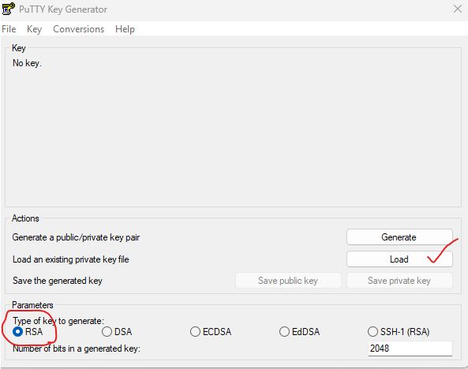
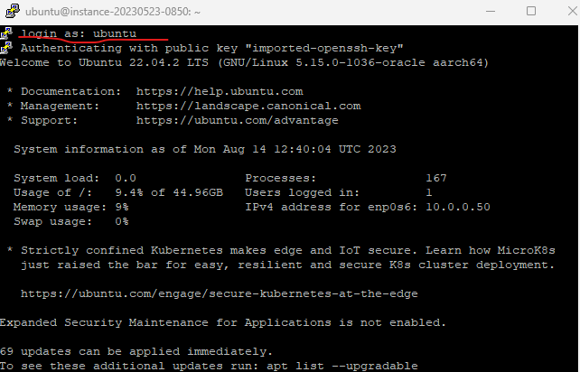

### LOGIN IN UBUNTU WITH PUTTY
--------------------------------------
* First we need to  give our instance public IP in the Login section.
   
   

* So after that we need to give our SSH prv key. Here we have two methods to configure our SSH PRV.
   * ONE: We can give our SSH key directly in the putty that can help as to login into our instance easily.
   
   * TWO: Here we need to convert our SSH key format into ppk format that can under by putty easy. For that we need to convert the key with help of putty key.
   
   

   
   
   
   
   * After converting the ssh key into ppk format we can see our key above how it looks ' PUTTYNEWKEYPAIR '
   * So we have the key now we need to add our key to the putty like this 
   
   

   
 

* After getting all the SSH connection information, followed by above steps, You can just login in to your machine now.
* Launch the PuTTY SSH client, then enter your server’s SSH IP and SSH Port. Click the Open button to proceed.
  
  

* A login as: message will pop up and asks you to enter your SSH username. For VPS users, this is usually root. However, for shared hosting users, you will need to enter a predefined username like u721233450. After entering your username, press Enter.