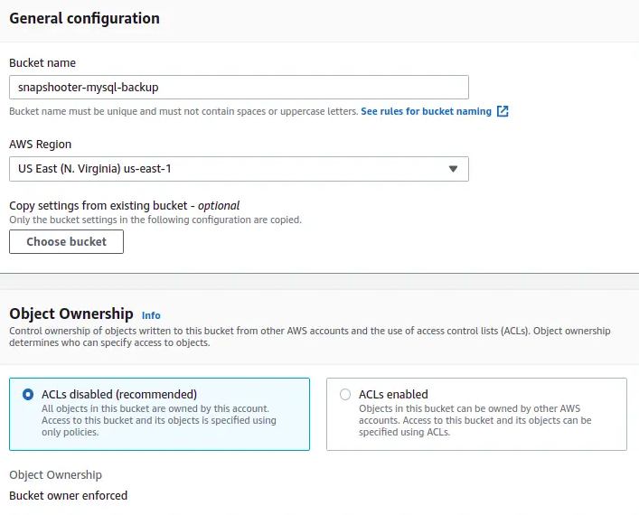

### RELATIONAL DATA BASE IN AWS.
-------------------------------
* In relatinal database we have many types of databases like below
  

* Now we are doing RDS with mysql database integrated with the S3 bucket. Here i need the daily mysql data backup data should be present in S3 bucket.
* I'M just creating the mysql database first we need to select the STANDARD CREATION after that select the database which you need i'm going with mysql.
* So here in addition to that we need to choose single or multi availablity zones. 
   

* Here we have a small problem with multi AZ (Multi AZ: one writeable other 2 stand by databases in different AZ). When we try to take the snapshots it will take the single snapshot for all three AZ. 
  
  

* So the single snapshot cannot be backup for all AZ.
* After that in credentials part like  Master username & Here we have both option to create a AUTOGENRATED OR MANUAL PASSWORD you can choose basis on your need. I'm going with manual 
* Standard class instance and Memory optimized instance: We mostly use both  class instance depending upon the requriment.
    
  
  

* Here we need to choose storage of database we need run.
  

* If you need to attache the EC2 Instance or without Instance you can choose here if you want to add any created specific instance.
   

* Now you need to select the PUBLIC OR PRIVATE DATA BASE you need to create obisiouly we need private database also we need to select the VPC and Security group.
  
  

* Give the port of mysql database access and Database Authentication.
  

* Performance insight is the mandantory filed which you need to select how many days do you need this database to be active.
  

* In Additional information we can see monitoring option so that if we need then you can select the monitoring.
* Also you need to select the DB cluster parameter group.
  
  

* Here come main role you need to selec the ENABLE AUTOMATION BACKUP AND ALSO YOU PUT TIMING for that at what the backup should be start.
  

* IN AWS Cloud watch we can see the AUDIT LOG, ERROR LOG, GENRAL LOG, SLOW QUERY LOG. If you select those from here.
  

* This would be better to don't select the maintance window when ever there will be a new update in AWS it will also update and this should be chance to DOWNTIME.
* Enable the DELECTION PROTECTION  if you mistakenly want to delete any database it won't delete the database.
* CHECK ONCES AGAIN AND CREATE THE DATABASE IT MIGHT TAKE 15 MINS TO CREATE   
  


* After creating the database we need to create a group and add the group
  

* Here if you can see i have already created a group called sample. While creating the Group you need to specify the engine version which is sql-server-ex-14.
  
  

* After Database created successfully you can able to see it in database section 
* Here in action pop you can able to the TAKE SANPSHOT.  
  

* In the snapshot section you can see the available snapshots.
  

* So after opening the sanpshot here also in action you can see EXPORT TO S3 BUCKET.
  

* Now we need to create a S3 bucket. Go to create bucket and give the bucket name, select the region, choose if you want to put one more stand by S3 for creating S3 bucket. After that select the ownership.
  
  

* Block all Public Access setting read it carefully if you want to allow any. Disable the Bucket Versioning.
  

* If you have specific tag then you can give a tag. So Deafult Encryption is depends on your type of key configuration i had taken the AWS KEY MANAGEMENT SERVICE (KMS).
* Enable the bucket key is the good practice. Now click on creat BUCKET.
  
  


* So here we have exported successfully with S3 bucket.
  

* As you can see in our S3 bucket also we able to see the backup folder of database.

  

 
  
* Refer here to see the configuration RDS WITH S3 BUCKKET to backup
  
   ![refe here]https://www.youtube.com/watch?v=lyNGeDg6EII


#### IN EC2 installation of mysql & BACKUP TO S3 

* VERY IMPORTANT NOTES REFER THE BOTH LINK 
   * THIS IS FOR CREATING USER ADDING GROUP & POLICES TO USER. CREATING S3 BUCKET & CONFIGURATION OF MYSQL TO S3
    
    ![REFER HERE]https://snapshooter.com/learn/backup-mysql-to-s3

  * THIS FOR INSTALLATION OF MYSQL AND SETTING IT UP 
    
    ![REFER HERE]https://www.digitalocean.com/community/tutorials/how-to-install-mysql-on-ubuntu-20-04

  * THIS IS FOR AUTOMATION THE MYSQL SERVRE TO S3 USING SHELL SCRIPT AND CROWN JOB EXPRESSION.
    ![REFER HERE]https://www.youtube.com/watch?v=AoH9E2kbxCI
    ![refer here]https://saturncloud.io/blog/how-to-take-mysql-database-backup-and-put-it-in-amazon-s3-every-night-using-cron-tab/#:~:text=Log%20in%20to%20your%20AWS,the%20%E2%80%9CCreate%20bucket%E2%80%9D%20button.


  * To automation basic shell script
 ```
 #!/bin/bash

while :
do
	dt=$(date '+%d%m%y')
	tm=$(date '+%H%M')
	if [ ${tm} -gt 0015 -a ${tm} -le 0115 ]
	then 
      mysqldump --user=${root} --password=${omits#Implant1} MoneyBridge > MoneyBridge-backup.sql
		  scp /home/ubuntu/backup/MoneyBridge-backup.sql .
		  aws s3 cp /home/ubuntu/backup/MoneyBridge-backup.sql s3:mysqlbackupdata
      rm /home/ubuntu/backup MoneyBridge-backup.sql

      mysqldump --user=${root} --password=${omits#Implant1} Project > Project-backup.sql
      scp /home/ubuntu/backup/Project-backup.sql .
      aws s3 cp /home/ubuntu/backup/Project-backup.sql s3://mysqlbackupdata
      rm /home/ubuntu/backup Project-backup.sql

      mysqldump --user=${root} --password=${omits#Implant1} Recruit > Recruit-backup.sql
      scp /home/ubuntu/backup/Recruit-backup.sql .
      aws s3 cp /home/ubuntu/backup/Recruit-backup.sql s3://mysqlbackupdata
		  rm /home/ubuntu/backup Recruit-backup.sql

      mysqldump --user=${root} --password=${omits#Implant1} micro > micro-backup.sql
      scp /home/ubuntu/backup/micro-backup.sql .
      aws s3 cp /home/ubuntu/backup/micro-backup.sql s3://mysqlbackupdata
		  rm /home/ubuntu/backup micro-backup.sql
      sleep 3300
	  else
		  sleep 3300
	  fi

done


TO run the background : nohup ./backup &
TO see the background running : ps -ef|grep backup
To see the sleep mode :ps -ef|grep sleep


* To edit the crontab crontab -e
* To see background running crontab crontab -l
0 0 * * * /path/to/mysql-backup.sh

```

