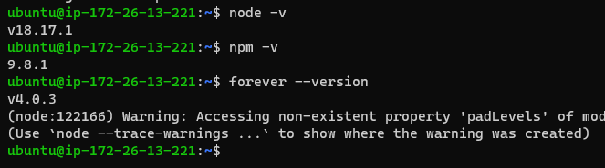
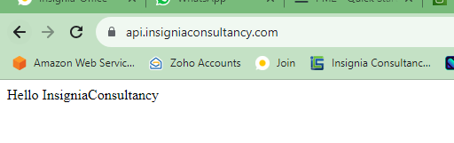
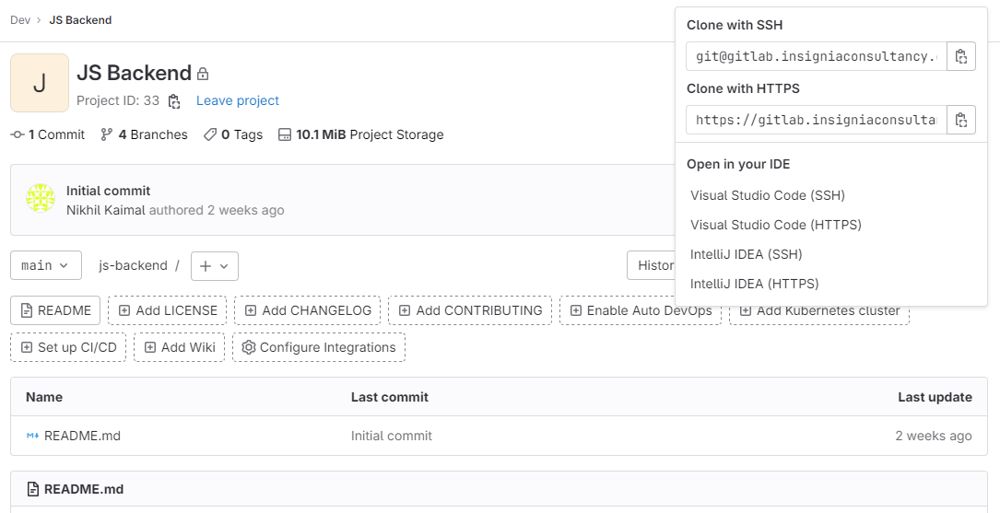
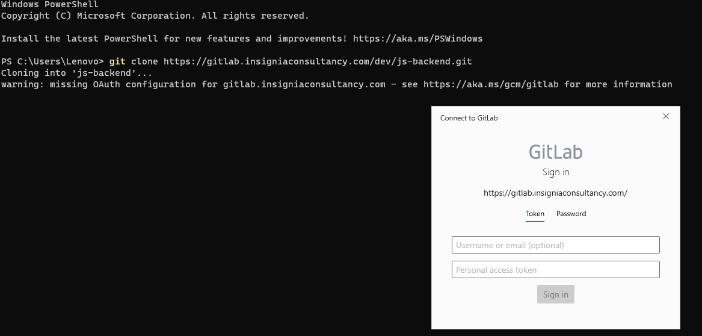
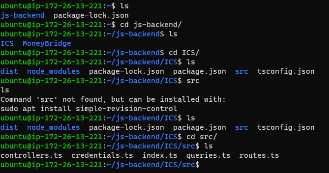

### Deployment Of Micro Services
-------------------------------------------
* The most basic form of microservice deployment uses a single machine. The application is a group of processes coupled with load balancing. ​This simple approach has some clear benefits: Lightweight: there is no overhead as it's just processes running on a server.
* We have the server called API-DEV in Amazon Lightsail Service. In that service we need to git clone the repo of JS-BACKEND.
* When we do git clone the data available in repo will be cloned into server. After that we can do futher process like run the code.
* So first we need to be install the dependency of our code like node, npm, forever.
  
  ```
  npm install 
  npm update
  npm install forever
  npm install node
  ``` 

  
  
* As initial conditions, you must have a domain name. It's DNS A-record must contain the public address of your server. If the firewall is enabled, open access for HTTP and HTTPS traffic.
* Here we need allow some ufw ports like below 
  
  ```
  sudo ufw allow 80
  sudo ufw allow 443
  ```

### Step 1 – Installing the "Let's Encrypt" package

* The process of installing the "Let's Encrypt" package with all its dependencies is extremely simple. To do this, enter the command.

  ```
  sudo apt install letsencrypt

  ```
 
* Along with the "Let's Encrypt" package, this command also installs the "certbot.timer" utility for automatic certificate renewal. It checks the validity of SSL certificates in the system twice a day and extends those that expire in the next 30 days. To make sure that it is running, enter.
  ```
  sudo systemctl status certbot.timer
  ```
* There are different configurations and conditions for obtaining a certificate. Let's look at some of them.
  
### Step 2 – Standalone server for getting the "Let's Encrypt" SSL certificate

* The easiest way to get an ssl certificate is to use a standalone option in Certbot. Replace domain-name.com with your domain name, run the command, and follow the instructions.

  ```
  sudo certbot certonly --standalone --agree-tos --preferred-challenges http -d domain-name.com

  ```
* The certonly option means that the certificate will only be obtained without installation on any web server, standalone allows you to start your own web server for authentication, agree-tos means acceptance of the ACME server subscription agreement, which is a prerequisite, and preferred-challenges http means performing authorization using HTTP.

### Step 3 – Automatic installation of the SSL certificate on nginx and Apache web servers

* Certbot can automatically install the certificate on nginx and Apache web servers. To do this, you need to install an additional package and choose the appropriate one for your web server.

  ```
  apt install python3-certbot-nginx
  apt install python3-certbot-apache
  ```
* Run this command for nginx. 
  
  ```
  sudo certbot --nginx --agree-tos --preferred-challenges http -d domain-name.com

  ```

* Run this command for Apache.
  
  ```
  sudo certbot --apache --agree-tos --preferred-challenges http -d domain-name.com

  ```

* Follow the instructions and Certbot will install an SSL certificate for you.

### Step 4 – "Let's Encrypt" Wildcard SSL certificate

* To create a wildcard certificate, the only possible challenge method is DNS. In the d parameter, you must specify both the bare domain and wildcard.

  ```
  sudo certbot certonly --manual --agree-tos --preferred-challenges dns -d domain-name.com -d *.domain-name.com

  ```
* Here if you can see the site is secure
  
  

* After that, place the specified TXT record on your DNS server and click continue.

* If everything is well, you will see the path where your new wildcard certificate is stored and some other information.

* After secure the URL now we can run the commands to run node files.

### GITLAB SERVER 

* Now we need to login gitlab server and gitclone of repo then we can run the code in server.
  
  

* So for git clone we need to give login credentials ( we can do with configuration of ssh key with gitlab server )
  
  
  
* After git cloned the repo we can se js-backend is our repo and in that we need to nagivate the source file of index.ts in both ICS and MONEYBRIDGE. 
* Here we need to run the index.ts for one time   

  


### BACKGROUND RUN OF MICRO SERVICES USING FOREVER & PM2

* So now we need to run the code for that we have two methods. FOREVER & PM2.
* FOREVER: This can run only the file not the whole branch like ICS 
* PM2: This can the run the direct command which we need to run. It will run the background.

### NODE-JS TEST API-DEV
----------------------------------

* First we need to install some dependices to that server like GitlaB, Node-js, Forever, PM2.
*  Some times we can't use the forever because it shuold only the file not the whole branch. So we use the pm2 to run background same like forever here we can run our direct command.
* Refer Here for pm2 commands 
   
   ![refer here]https://pm2.keymetrics.io/docs/usage/quick-start/

* we already know how install a gitlab-ce in the server refer the documentation for process.
  ``` 
  sudo apt install npm
  sudo npm instal forever
  ```
  ```
  sudo npm install -g pm2
  pm2 start --name my-app "sudo npm run dev"
  pm2 list
  pm2 show my-app
  ```
* If you don't have pm2 installed, you can install it globally using npm.
* You can use pm2 to run your sudo npm run dev command in the background. Open your terminal and navigate to the directory where your Node.js application is located. Then run.
* Here, "my-app" is a user-defined name for your process. You can choose any name you like.
* You can monitor the status of your application and view logs using pm2 commands. For example
* To view detailed information about a specific process (replace my-app with your process name or ID):pm2 show my-app
  
  
  
  

* To DELETE or STOP the pm2 process we have one commands if it doesn't stop with that command we have to do direct kill process.

  ```
  pm2 delete my-app or id number

  ``` 
  ```
  sudo lsof -i :3001
  kill -9 pid number 
  ```
  

* Now we need to take the code from git lab server for the first time we need to take the gitclone link from gitlab server like below.
  
  

* when we want to just pull the new code changes we can do git pull

  

* After that go the particular path or folder where the code is present. So we have ICS & MoneyBridge, In ICS i have index.js  file so i need to run that file here i should we the forever command.
* We can stop forever stop and pid number from any folder, But we can't start the .js file from any where unless your in particular folder

  
  
  

* Here we can see the forever logs files. For that we have to be a root user in that if do below command.

  ```
  cd /root/.forever/
  ```
   

* so here some forever command we can see the list of background running file through forever.
  
  

  ```
  forever start <filename>
  forever stop <pid no>
  forever list
  forever --help
  ```
* As you can see now we had run the both code of ICS & MoneyBridge parallel in the single server with different ports with forever.
 
  
  


  
